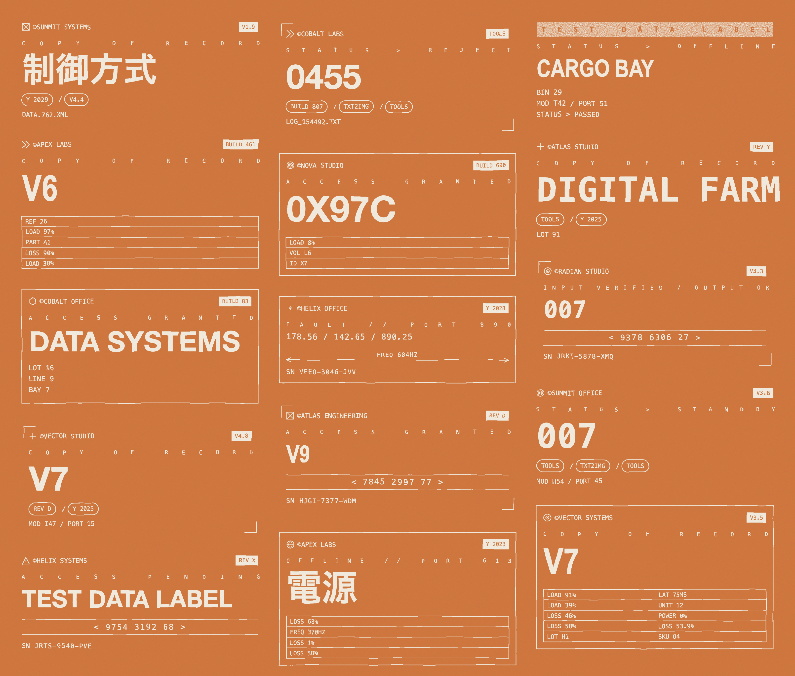
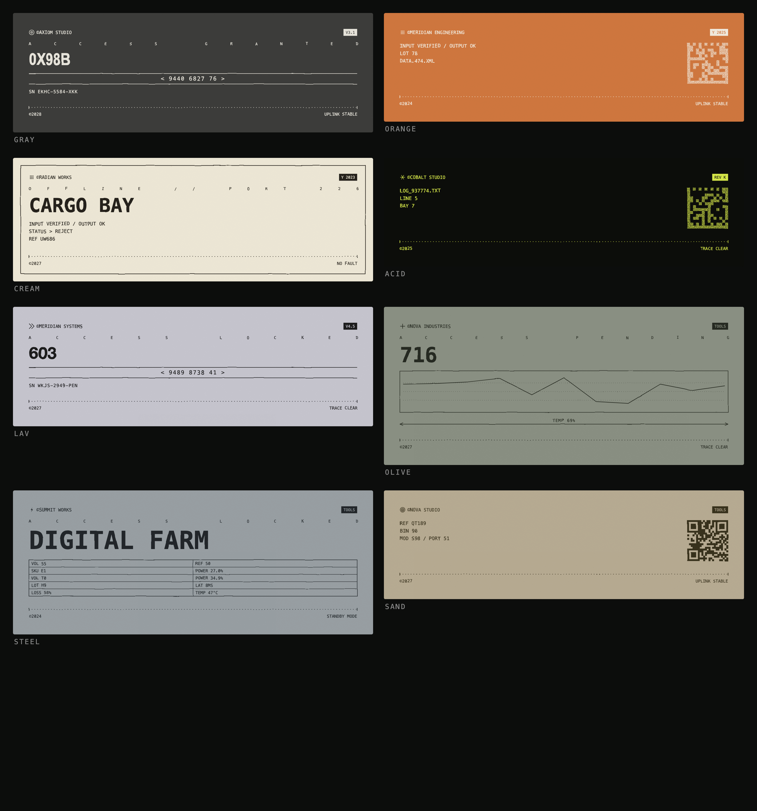

# MicroGfx

A tiny, dependency-free library for generating **hand-drawn "technical instrument" graphics** — fake telemetry cards, spec labels, and contact-sheet posters — as pure SVG. Hit *Lucky* and it composes a new one; export to PNG or SVG.



## Run it

No build step, no server. Just open the studio:

```
open index.html      # macOS  (or double-click the file)
```

- **Space** — new draw (Lucky)
- **1 / 2 / 3** — Card / Banner / Poster modes
- **P / S** — export PNG / SVG
- **Theme** dropdown — pick a palette or *Auto*
- Click the seed to copy it (same seed always reproduces the same piece)

## What it makes

| Mode | Description |
|------|-------------|
| **Card** | A single label whose **height adapts to its content** — a barcode card is short, a chart card is tall. Footer-anchored. |
| **Banner** | Wide corner-bracketed hero with big display type. |
| **Poster** | A masonry contact sheet of 12–16 mini-compositions sharing one theme. |

Eight themes ship in the registry — gray, orange, cream, acid-on-black, lavender, olive, steel, sand:



## How it works

Everything is built from three composable layers, which is what lets one small codebase span cards, banners, and posters:

```
1. ELEMENTS   ~25 self-measuring components:  (ctx) => { svg, h }
              brandLine · eyebrow · bigDisplay · dataTable · barcode · qrcode
              · dataMatrix · lineChart · waveform · dimension · pillRow · iconRow
              · titleBar · bracketRule · coordReadout · hatch · spring · dividers · footer
2. LAYOUT     recursive containers  stack() / row()  — themselves elements,
              so a row can hold a stack that holds a row (the "QR + readouts" splits)
3. COMPOSE    a grammar of templates that assembles elements into whole cards
```

Because **every element reports its own height**, containers flow them automatically — no manual coordinate math, and layout nests arbitrarily.

The hand-drawn look is two SVG filters:

- **`#warp`** — `feTurbulence` → `feDisplacementMap` distorts every stroke *and* glyph uniformly, so the whole thing reads as sketched by one hand.
- **`#erode`** — a turbulence alpha-mask composited into heavy fills only (barcodes, QR, inverted bars) for the screen-printed grain.

## API

```js
const gen = MicroGfx.generate({ mode: "poster", theme: "orange", seed: 42 });
// -> { inner, w, h, seed, theme }     inner = the SVG body markup

document.querySelector("#stage").innerHTML =
  `<svg viewBox="0 0 ${gen.w} ${gen.h}">${gen.inner}</svg>`;

const svgText = MicroGfx.standalone(gen, 2);   // export-ready <svg> string at 2x
```

`generate()` takes `{ mode, theme, seed }` — omit `seed` for random, use `theme: "auto"` to pick one at random.

## Extending it

Every part is a registry you can mutate from outside. Add an element and the grammar can immediately use it:

```js
// a new element (must return { svg, h })
MicroGfx.elements.gauge = (ctx) => {
  const pct = ctx.r.int(0, 100);
  return { svg: /* svg string drawn from ctx.x / ctx.y / ctx.w */ "", h: 40 };
};

// a template that uses it
MicroGfx.templates.push((r) => ({
  frame: "full",
  children: [{ type: "brandLine" }, { type: "gauge" }, { type: "dimension" }],
}));

// a new theme
MicroGfx.themes.neon = { bg: "#05070a", ink: "#39f5c8", erode: true, grain: .05, warp: 2.4 };
```

Registries: `MicroGfx.elements`, `.templates`, `.themes`, `.marks` (logo glyphs), `.frames`.

## Files

- **`microgfx.js`** — the built library, a single self-contained file (a UMD-ish bundle: `window.MicroGfx` in the browser, `module.exports` in Node so you can generate SVGs headless). This is committed, so consuming it needs no build step.
- **`index.html`** — the studio UI that consumes it via a plain `<script src>`.
- **`src/`** — the TypeScript source the bundle is built from.

## Developing

The source lives in `src/` as focused TypeScript modules; esbuild bundles them into `microgfx.js`. Only contributors need this — end users just open `index.html`.

```
npm install
npm run build       # bundle src/ -> microgfx.js
npm run dev         # rebuild on change (watch)
npm run typecheck   # tsc --noEmit
```

The layers map to files, each free to grow without touching the others:

| File | Responsibility |
|------|----------------|
| `rng.ts` · `text.ts` · `svg.ts` | seeded PRNG · text measurement · SVG primitives + shared draw state |
| `content.ts` · `marks.ts` | text/number pools · logo & icon glyphs |
| `elements.ts` · `layout.ts` | leaf `EL.*` components · recursive `stack` / `row` + `draw` |
| `themes.ts` · `frames.ts` · `compose.ts` | palettes · outer frames · the template grammar |
| `render.ts` · `index.ts` | filters + `generate` / `standalone` · public API assembly |

Adding a component is usually a one-file change: a new element in `elements.ts`, a glyph in `marks.ts`, a palette in `themes.ts`, or a template in `compose.ts`. (You can also add any of these at runtime — see **Extending it** above.)

## Notes

- Display and CJK glyphs use **system font stacks** (Impact / Arial Narrow / Helvetica + the OS CJK font), so exported files render with whatever fonts the viewer has installed — exact weights vary per machine. Point `MicroGfx.themes[x].display` at an embedded base64 font for pixel-identical exports.
- QR / data-matrix codes are **decorative** (correct finder patterns and quiet zones, random payload) — they don't encode real data.

## License

MIT
